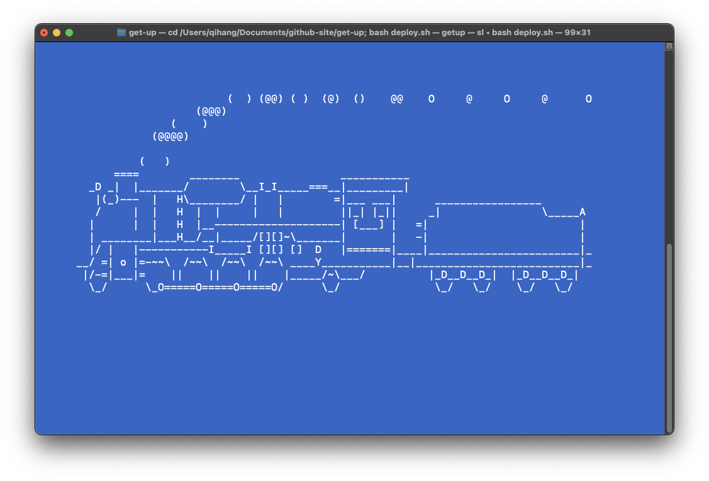

This is a project to document the time you get up everyday and visualize it in a website. The project is based on `mkdocs` and `mkdocs-material` package. The website is hosted on github page.
## To make the project for your own:
1. fork the project to your own github account
2. **delete** the `docs/data` folder
3. modify the `mkdocs.yml` file to change the `site_name` and `repo_url` to your own
4. install the `mkdocs` and `mkdocs-material` package
```shell
pip install mkdocs
pip install mkdocs-material
# (optional)if you are using mac, you can install the package by brew:
brew install sl
# (optional)if you are using linux, you can install the package by apt:
sudo apt-get install sl
```
5. modify the parameter in deploy.sh `cutoff` to what you want, for `generate_md.py`it should be the upper bound of the time you get-up.
```shell
python generate_md.py --cutoff $a float number
```
6. for `generate_csv.py` it should be the lower bound of the time you get-up.
```shell
python generate_csv.py --cutoff $a float number
```
7. run the following command to generate html and push to github

```shell
bash deploy.sh
```
8. set the github page to the `gh-pages` branch
9. set shortcut in your laptop to run the `deploy.sh` command to update the website: add this in your `.bashrc` or `.zshrc` file 
```shell
alias getup="cd $project_position; bash deploy.sh"
```
Congratulations! now you can open your terminal and type `getup` to document your get-up time!


## Frequent Command for MkDocs

### to preview website locally:

```shell
mkdocs serve --watch-theme
```

### to kill preview program:
```shell
ps -fA | grep python
```

### to release website:
```shell
mkdocs gh-deploy
```


