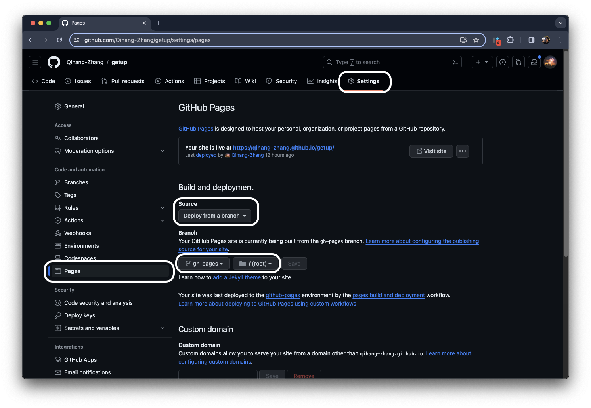
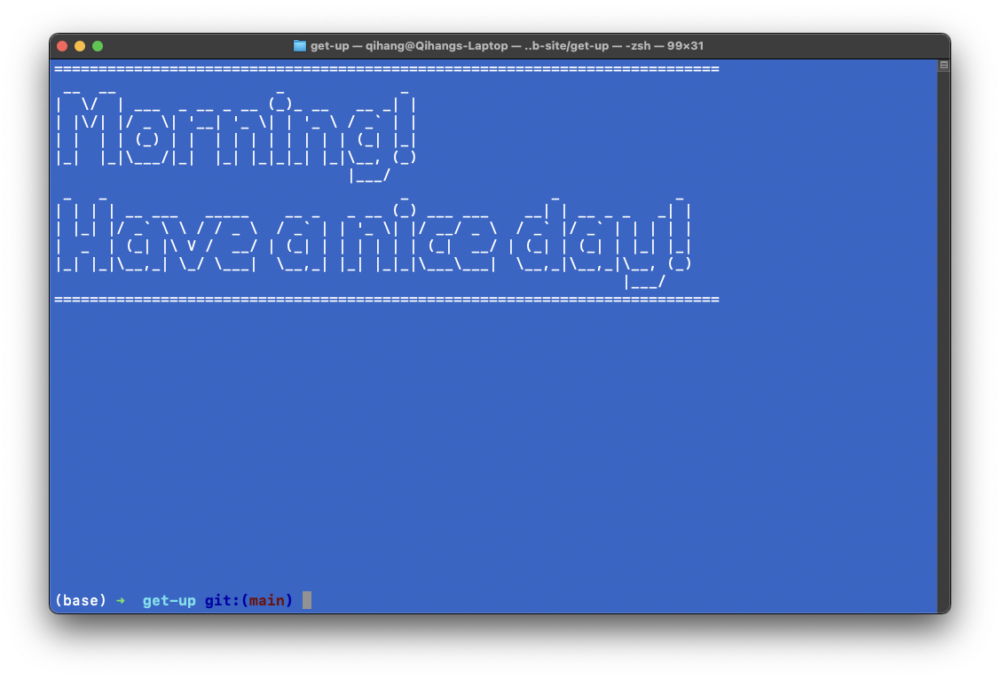
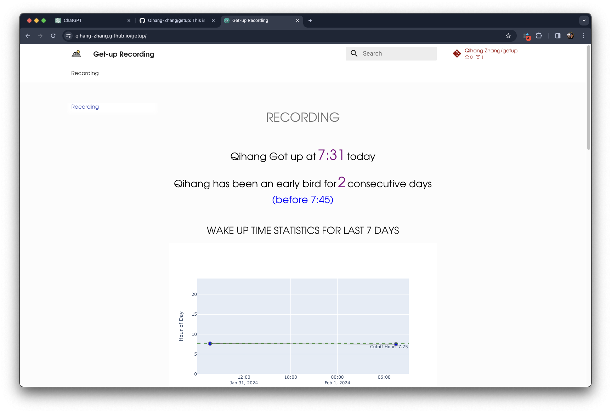

This is a project to document the time you get up everyday and visualize it in a website. It will document the first time when you type `getup` in your terminal everyday. The project is based on `mkdocs` and `mkdocs-material` package. The website is hosted on github page. To preview the website, please click [here](https://qihang-zhang.github.io/getup/).
## To make the project for your own:
1. fork the project to your own github account, git clone the project to your local.
2. **delete** the `docs/data` folder
3. modify the `mkdocs.yml` file to change the `site_name` and `repo_url` to your own
4. install the `mkdocs`, `mkdocs-material` package, and `sl` package(if you haven't install python3, please install python3 first: [python3](https://www.python.org/downloads/), [anaconda](https://www.anaconda.com/products/distribution) or [miniconda](https://docs.conda.io/en/latest/miniconda.html))
```shell
pip install mkdocs
pip install mkdocs-material
# (optional)if you are using mac, you can install sl by brew:
brew install sl
# (optional)if you are using linux, you can install sl by apt:
sudo apt-get install sl
# (optional)if you are using mac, you can install figlet by brew:
brew install figlet
# (optional)if you are using linux, you can install figlet by apt:
sudo apt-get install figlet
```
5. modify the parameter in deploy.sh file to your own
```shell
python main.py \
--cutoff $before when you would never get up but stay up late(float) \
--getup_threshold $time you should get up(float) \
--recent_days $how many day you want to show details of get-up \
--name $your name
```
6. run the following command to generate html and push to github

```shell
bash deploy.sh
```
7. set the github page to the `gh-pages` branch

8. set shortcut in your laptop to run the `deploy.sh` command to update the website: add this in your `~/.bashrc` if you use bash, add it in your `~/.zshrc` if you use zsh.
```shell
alias getup="cd $project_position; bash deploy.sh"
```
Congratulations! now you can open your terminal and type `getup` to document your get-up time! after that, there will be a train running in your terminal to celebrate your get-up time!:



9. if you want to mannually update the get-up time, you can run the main.py and add this parameter.
```shell
python main.py --manual_recording 1 \
--name $yourname \
--other_parameter_you_want_to_add
```
## Frequent Command for MkDocs

### to preview website locally:

```shell
mkdocs serve --watch-theme
```

### to kill preview program:
```shell
ps -fA | grep python
```

### to release website:
```shell
mkdocs gh-deploy
```


